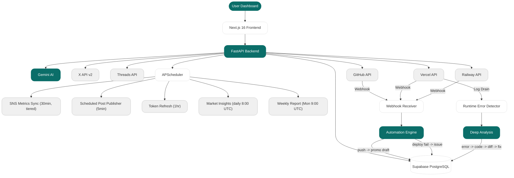
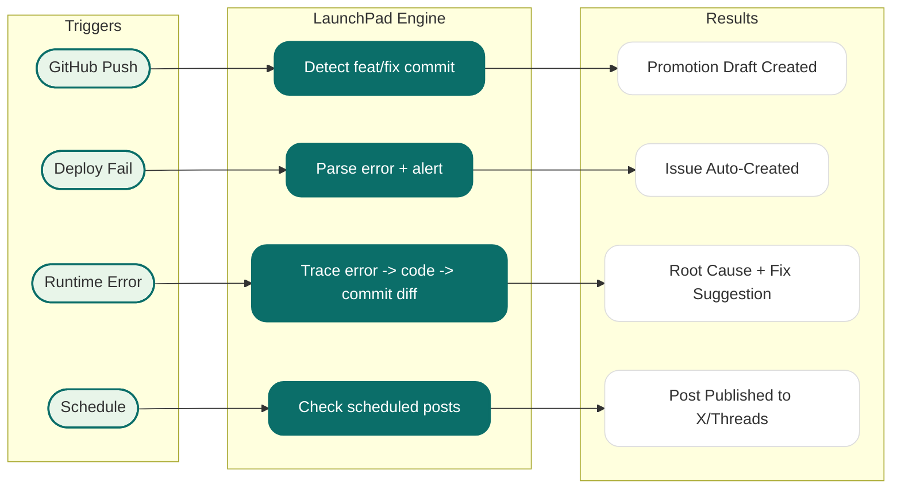

<h1 align="center">
  LAUNCH.PAD
</h1>

<h3 align="center">
  The command center for indie product builders.
</h3>

<p align="center">
  Promote. Monitor. Analyze. Ship faster.
</p>

<p align="center">
  
  
  
  
  
  
</p>

<p align="center">
  <a href="docs/API_REFERENCE.md"><strong>API Reference</strong></a>&nbsp;&nbsp;|&nbsp;&nbsp;
  <a href="docs/specs/TECHNICAL_SPEC.md"><strong>Technical Spec</strong></a>&nbsp;&nbsp;|&nbsp;&nbsp;
  <a href="backend/.env.example"><strong>Environment Setup</strong></a>
</p>

---

## What is LaunchPad?

LaunchPad is a SaaS platform where indie hackers manage everything about their product from a single dashboard:

**AI Promotion** -- Generate and publish posts to X and Threads with AI. Scheduled posting, engagement tracking.

**Deploy Monitoring** -- Connect Vercel/Railway. Get alerts on failures. AI analyzes error logs, traces through your actual source code and recent commits, tells you exactly what broke and how to fix it.

**Market Intelligence** -- Daily competitor analysis and trend reports powered by Gemini with real-time web search.

**GitHub Integration** -- Issues sync, commit tracking. Push a feature commit and get a promotion draft auto-generated.

**Smart Insights** -- Optimal posting time, weekly reports, anomaly detection. All computed from your own data at zero extra API cost.

---

## Architecture



---

## Automation Flow



---

## Tech Stack

| Layer | Technology |
|---|---|
| **Frontend** | Next.js 16, React 19, TypeScript, Tailwind CSS v4, shadcn/ui, Framer Motion |
| **Backend** | FastAPI, Python 3.11+, Pydantic, APScheduler, slowapi |
| **Database** | Supabase (PostgreSQL 15+, RLS, Realtime) |
| **Auth** | Supabase Auth (Google OAuth) + per-service OAuth (X, Threads, GitHub, Vercel, Railway) |
| **AI** | Google Gemini 2.5 Flash (structured output, search grounding) |
| **Security** | Fernet encryption, HMAC webhook verification, rate limiting, PKCE |
| **Deploy** | Vercel (frontend) + Railway (backend) |

---

## Getting Started

### Prerequisites

- Node.js 18+
- Python 3.11+
- Supabase project with Google OAuth enabled

### 1. Clone

```bash
git clone https://github.com/Next-TeamA/indie-product-hub.git
cd indie-product-hub
```

### 2. Backend

```bash
cd backend
python3 -m venv venv
source venv/bin/activate

pip install -r requirements.txt

cp .env.example .env
# Fill in your credentials (see Environment Variables below)

uvicorn app.main:app --reload --port 8000
```

### 3. Frontend

```bash
cd frontend
npm install
cp .env.local.example .env.local
# Fill in Supabase URL, Anon Key, API URL

npm run dev
```

### 4. Database Migrations

Run in **Supabase SQL Editor** in order:

```
backend/supabase/schema.sql
backend/supabase/migrations/001_extend_schema.sql
backend/supabase/migrations/002_oauth_states_and_fixes.sql
```

---

## Environment Variables

### Backend (`backend/.env`)

| Variable | Required | Where to get it |
|---|---|---|
| `SUPABASE_URL` | Yes | Supabase Dashboard > Settings > API |
| `SUPABASE_KEY` | Yes | Supabase Dashboard > Settings > API (anon key) |
| `SUPABASE_SERVICE_ROLE_KEY` | Yes | Supabase Dashboard > Settings > API |
| `SUPABASE_JWT_SECRET` | Yes | Supabase Dashboard > Settings > API > JWT Secret |
| `GEMINI_API_KEY` | Yes | https://aistudio.google.com/apikey |
| `ENCRYPTION_KEY` | Yes | `python -c "from cryptography.fernet import Fernet; print(Fernet.generate_key().decode())"` |
| `X_CLIENT_ID` | For X | https://developer.x.com |
| `X_CLIENT_SECRET` | For X | Same |
| `THREADS_APP_ID` | For Threads | https://developers.facebook.com |
| `THREADS_CLIENT_SECRET` | For Threads | Same |
| `GITHUB_CLIENT_ID` | For GitHub | https://github.com/settings/developers |
| `GITHUB_CLIENT_SECRET` | For GitHub | Same |
| `VERCEL_CLIENT_ID` | For Vercel | https://vercel.com/account/integrations |
| `VERCEL_CLIENT_SECRET` | For Vercel | Same |
| `RAILWAY_CLIENT_ID` | For Railway | Railway Workspace > Developer |
| `RAILWAY_CLIENT_SECRET` | For Railway | Same |

### Frontend (`frontend/.env.local`)

| Variable | Required | Where to get it |
|---|---|---|
| `NEXT_PUBLIC_SUPABASE_URL` | Yes | Supabase Dashboard |
| `NEXT_PUBLIC_SUPABASE_ANON_KEY` | Yes | Supabase Dashboard |
| `NEXT_PUBLIC_API_URL` | Yes | `http://localhost:8000` |

---

## API Overview

**40+ endpoints** across 14 routers. Full documentation: **[API_REFERENCE.md](docs/API_REFERENCE.md)**

| Category | Endpoints | Description |
|---|---|---|
| **Projects** | 5 | CRUD for indie products |
| **Events** | 4 | Calendar event management |
| **Issues** | 4 | Issue tracking (manual + auto-created from deploys/errors) |
| **Promotion** | 9 | AI content generation, post management, X/Threads publishing |
| **Insights** | 2 | Marketing analytics, operations overview |
| **Market Insights** | 3 | AI competitor/trend analysis with real-time web search |
| **SNS Metrics** | 6 | X and Threads engagement data (live + stored) |
| **Accounts** | 4 | OAuth connect/disconnect for 5 services |
| **Alerts** | 3 | Notification management |
| **Deployments** | 2 | Deploy log tracking + sync from platforms |
| **Automation** | 4 | Optimal posting time, weekly report, GitHub sync, error analysis |
| **Webhooks** | 3 | GitHub, Vercel, Railway event receivers |
| **Log Drain** | 1 | Real-time Vercel runtime error detection + AI analysis |
| **Health** | 1 | Health check |

---

## Key Automations

| Trigger | What happens | User action |
|---|---|---|
| **GitHub push** (feat/fix) | AI generates promotion draft | Review and publish |
| **Deploy fails** | Issue created + critical alert | Fix the bug |
| **Runtime errors** | AI traces through source code + commit diffs | Apply the suggested fix |
| **Every 30 min** | SNS metrics synced (cost-optimized) | None |
| **Daily 8:00 UTC** | Market insights generated (Gemini + web search) | Read and act |
| **Monday 9:00 UTC** | Weekly report generated | Review |
| **Token expiring** | Auto-refreshed | None |
| **Scheduled time** | Post published to X/Threads | None |

---

## Project Structure

```
indie-product-hub/
  frontend/                    Next.js 16 + TypeScript
    src/app/                   App Router pages
    src/components/            UI components
    src/lib/                   API clients, Supabase, utils

  backend/                     FastAPI + Python
    app/
      api/routes/              14 route modules (40+ endpoints)
      api/dependencies/        Auth, project access verification
      core/                    Config, encryption, rate limiting, exceptions
      integrations/            X, Threads, GitHub, Vercel, Railway, Gemini
      services/                Automation, insights, deploy analysis, deep analysis
      workers/tasks/           5 scheduled background jobs
      models/                  Pydantic request/response schemas
    supabase/
      schema.sql               Base schema (11 tables)
      migrations/              Incremental migrations

  docs/
    API_REFERENCE.md           Complete endpoint documentation
    specs/TECHNICAL_SPEC.md    Architecture and design decisions
```

---

## Team

**Korea University NEXT Startup Club -- Team A**

<table>
  <tr>
    <td align="center">
      <a href="https://github.com/danlee-dev">
        <br />
        <sub><b>Lee Seongmin</b></sub>
      </a><br />
      <sub>Backend / Architecture</sub>
    </td>
    <td align="center">
      <a href="https://github.com/kkum2">
        <br />
        <sub><b>Park Bogyeom</b></sub>
      </a><br />
      <sub>Frontend / Design</sub>
    </td>
    <td align="center">
      <a href="https://github.com/hyeongsigjo40-jpg">
        <br />
        <sub><b>Jeong Hyeongsik</b></sub>
      </a><br />
      <sub>Frontend</sub>
    </td>
    <td align="center">
      <a href="https://github.com/kwakminji">
        <br />
        <sub><b>Kwak Minji</b></sub>
      </a><br />
      <sub>Frontend</sub>
    </td>
  </tr>
</table>

---

## License

MIT
